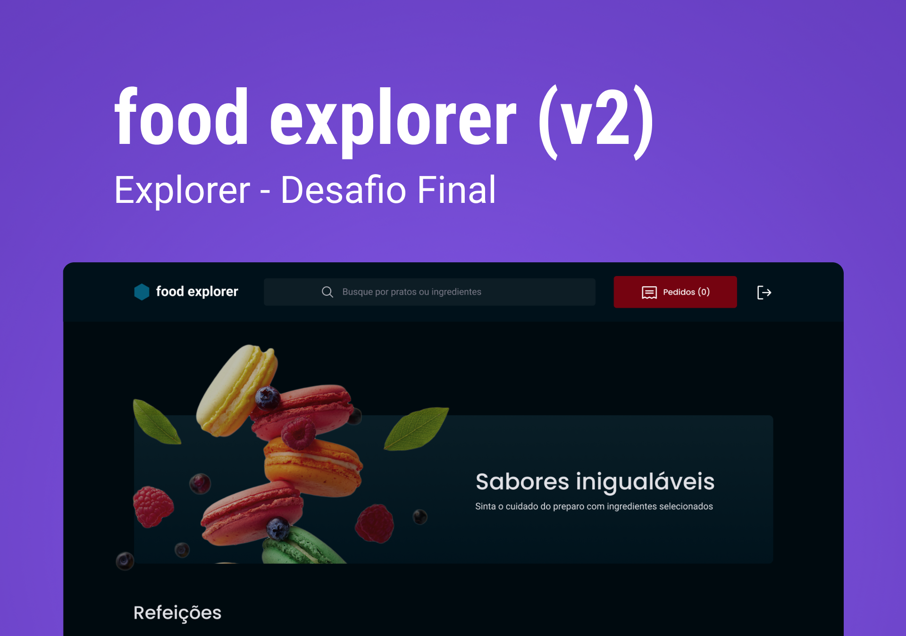

# coead

## Projeto de frontend para aplicação coead

<p align="center">
  <h1 align="center"><a href="https://stately-cajeta-ac26ef.netlify.app/">coead - Rocketseat Explorer 🚀 </a></h1>
</p>

___

## 💻 Sobre

O coead é uma aplicação web fictícia para gerenciamento de restaurantes e solicitação de direta pelo cliente. A aplicação é totalmente responsiva para a utilização através dos mais diversos dispositivos! Após o cadastro na plataforma o usuário terá as permissões necessárias para criar cada pedido e acompanhar seu status. Como parte do desafio foi desenvolvida uma seção para os favoritos na página Home e uma página exclusiva para listagem de favoritos. A funcionalidade de carrinho e pagamento constam como opcional e serão desenvolvidos posteriormente. A aplicação é 100% funcional e o usuário pode navegar por diversas páginas e utilizar a barra lateral com controle dinâmico de aparência para navegação. Além disso, o avatar do usuário é disponibilizado no cabeçalho, permitindo que este atualize seus dados. O Administrador terá a capacidade de criar/editar/remover os pratos da forma que desejar.

Foi desenvolvida a logo marca do restaurante fictício com o auxílio de inteligencia artificial, mais precisamente, o DALL-E, da empresa de tecnologia OpenAI. Esta imagem acompanha tanto o administrador quanto o usuário comum por toda a navegação criando a identidade e associando a imagem da empresa para fidelização do cliente.

Neste repositório são encontrados os arquivos referentes ao FrontEnd em ReactJS desenvolvido para a resolução do desafio. Como forma de avançar ainda mais nos conhecimento sobre desenvolvimento de sistemas, utilizando bibliotecas e ferramentas atuais e demandadas pelo mercado, esta API utiliza a biblioteca MUI Material que permite ganho de produtividade e UI de excelência. Além disso, é apresentada um exemplo de tour de página e foi utilizado o swiper para dinamismo da página. Uma outra milha ainda foi percorrida, a aplicação foi desenvolvida utilizando o TypeScript.

___

## 🎨 Layout

O layout com todas as páginas obrigatórias e opcionais foi disponibilizada no figma por meio [DESSE LINK](https://www.figma.com/file/LOMJWIopGI0VwmAU9aT2YS/coead-v2?node-id=201-1532&t=zm3uJVZpfRMLBSLd-0).



## 📊📂🛠️ Projeto de execução

Foi desenvolvido um projeto de execução das atividades no Notion, pode-se verificar através [DESSE LINK](https://tremendous-mum-29f.notion.site/38b6fb43468a4aa4a042ac6b5c54fa5d?v=1f969ed94b7244db98ba7e2d0d51f704).

## 🛠 Tecnologias

As seguintes tecnologias foram empregadas na criação deste projeto:

- [ReactJS](https://pt-br.react.dev/)
- [Javascript](https://developer.mozilla.org/pt-BR/docs/Web/JavaScript)
- [Typescript](https://www.typescriptlang.org/pt/)
- [MUI Material](https://mui.com/)
- [Styled Components](https://styled-components.com/)
- [Icons Material](https://mui.com/material-ui/material-icons/)
- [Formik](https://formik.org/)
- [Yup](https://www.npmjs.com/package/yup?activeTab=readme)
- [JSON Web Token](https://www.npmjs.com/package/jsonwebtoken)
- [Swiper](https://swiperjs.com/)
- [DALL-E](https://openai.com/dall-e-2)
- [Axios](https://www.npmjs.com/package/axios)

___

## 🚀 Como utilizar

Clone o projeto para o local desejado em seu computador.

```bash
git clone https://github.com/jakunzler/coead-frontend
```

___

### 🚧 Executando o FrontEnd

```bash
# Navegue até o diretório do FrontEnd
$ cd coead-frontend

# Instale as dependências necessárias
$ yarn

# Agora inicie o servidor do FrontEnd
$ yarn dev
```

___

## Estrutura de pastas

```markdown
coead-frontend/
├── node_modules/
│   └── ...
├── public/
├── src/
│   ├── assets/
│   │   └── ...
│   ├── components/
│   │   └── ...
│   ├── hooks/
│   │   └── ...
│   ├── pages/
│   │   └── ...
│   ├── routes/
│   │   └── ...
│   ├── service/
│   │   └── ...
│   ├── styles/
│   │   └── ...
│   ├── utils/
│   │   └── ...
│   ├── main.tsx
├── .eslintrc.cjs
├── .gitignore
├── .index.html
├── package.json
├── README.md
├── tsconfig.json
├── vite.config.ts
└── yarn.lock
```

___

⚠️ **Importante**: Este projeto utiliza uma hospedagem gratuita para o back-end, portanto, pode haver atrasos no tempo de resposta do servidor e informações podem ser perdidas por inatividade no hospedeiro.

## 👩🏾‍💻 Personas

A aplicação coead possui duas personas principais: o admin e o usuário, mas foi previsto um terceiro usuário como suporte que tem acesso semelhante ao administrador. É possível criar um novo usuário ou testar a aplicação usando as seguintes informações de login:

Admin:

- E-mail: <admin@email.com>
- Senha: 123456

O admin tem acesso privilegiado e pode gerenciar o cardápio, adicionando, editando e removendo pratos, além de executar outras tarefas administrativas.

Usuário:

- E-mail: <user@email.com>
- Senha: 123456

O usuário tem acesso restrito às funcionalidades da aplicação, podendo visualizar o cardápio, filtrar pratos, ver detalhes de pratos específicos, favoritar pratos e adicionar pratos ao carrinho.

## 📝 Licença

Este projeto está sob a licença MIT.

___

Feito com 💜 by Jonas Augusto Kunzler 👋